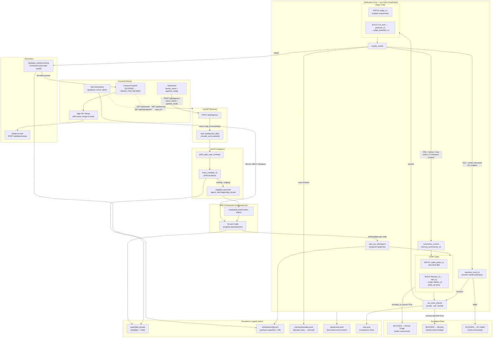

# Architecture Diagram

## Agenti-Helix — Multi-Agent Orchestration System

---

## Layer Summary

| Layer | Components | Responsibility |
|-------|-----------|---------------|
| **Entry** | UI Dashboard, `POST /api/dags/run`, `_compile_and_execute()` | Accept user intent; return `dag_id` immediately |
| **Compilation** | `intent_compiler_v1`, `_resolve_target_file()` | Decompose macro_intent → validated DAG of EditTaskSpecs |
| **Orchestration** | `execute_dag()`, topological sort, cascade-fail | Schedule nodes in dependency order; track state |
| **Verification** | LangGraph state machine (7 nodes), coder/judge chains | Apply edits; verify against acceptance criteria; retry |
| **Escalation** | `supreme_court_v1`, human escalation signal, security block | Resolve deadlocks or hand off to human |
| **Memory** | `memory/store.py`, `memory_summarizer_v1` | Learn from retries; compress error history |
| **Persistence** | `.agenti_helix/` file tree | Snapshot state for resumability and observability |
| **Observation** | Events JSONL, SSE stream, `/api/features` | Real-time UI updates; audit trail |
