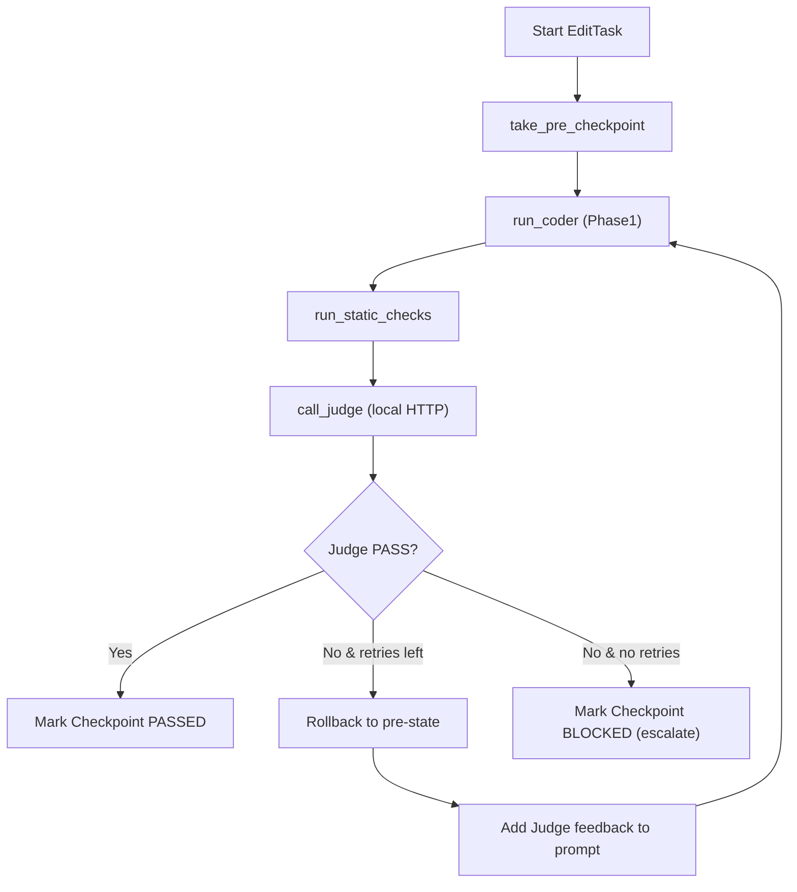

## Phase 2 – Verification Loop

Phase 2 wraps the Phase 1 single-file edit primitive in a **checkpointed, self-verifying loop** implemented as a LangGraph state machine. It introduces explicit checkpoints, a local Judge model, and deterministic retry/rollback semantics.

### Modules

- `phase2/checkpointing.py`: Task and checkpoint models, JSON-based persistence, and simple file-content rollback helpers.
- `phase2/judge_client.py`: HTTP client for the local Judge model service, plus `JudgeRequest`/`JudgeResponse` schemas.
- `phase2/verification_loop.py`: LangGraph graph that orchestrates the verification loop around `run_single_agent_edit`.
- `phase2/config.py`: Tunable configuration (Judge base URL, timeout, max retries).
- `phase2/cli.py`: Demo CLI wiring the loop to the `demo-repo` React project.

### Judge HTTP Contract

The Judge service is expected to expose a `POST /judge` endpoint that accepts JSON:

```json
{
  "acceptance_criteria": "string",
  "original_snippet": "string",
  "edited_snippet": "string",
  "language": "string",
  "tool_logs": {
    "static_checks": {
      "status": "SKIPPED",
      "reason": "No static checks configured for Phase 2 demo."
    }
  }
}
```

and returns:

```json
{
  "verdict": "PASS" | "FAIL",
  "justification": "short explanation",
  "problematic_lines": [1, 2, 3]
}
```

The Judge must behave as a **binary classifier**, not a generator.

### Verification Flow

The verification loop is modeled as the following graph:



### Running the Demo

1. Start a local Judge service that implements the HTTP contract above at `http://localhost:8000/judge`.
2. From the project root, run:

```bash
python -m phase2.cli
```

3. The CLI will:
   - Treat `demo-repo` as the target repository.
   - Define an `EditTaskSpec` to change the header button color in `src/components/header.js` to green.
   - Execute the verification loop, printing the final checkpoint status and Judge response.

